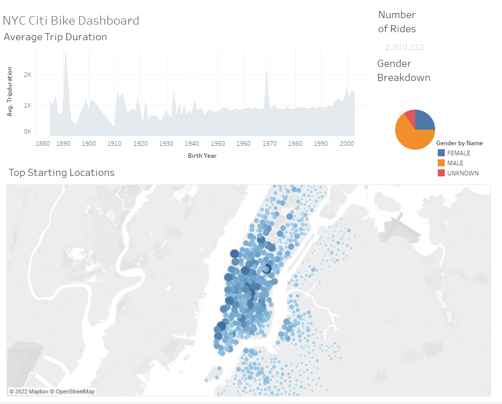
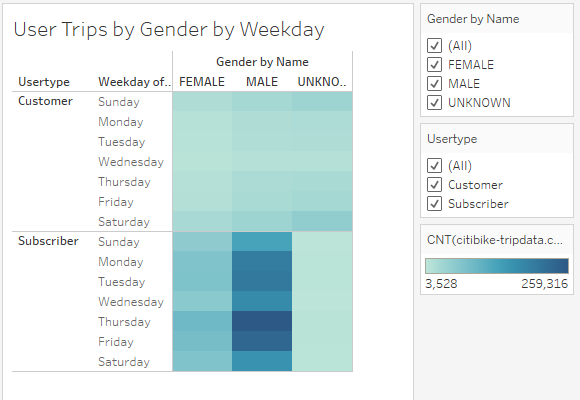

# bike sharing

## Overview

The company Citi Bike is a successful bike share company based out of New York City. Their business has inspired a new bike share startup seeking to open operations in Des Moines, Iowa. Using data from the companies operations in August of 2019 we will show our shareholders what market exist for a bikeshare company. With this data we will go over 7 graphics displaying key parts of the bike share business and explain what’s significant.
## Analysis

  
The set of graphics displayed above show key data points about the bike share userbase. These key pieces of data include age, gender, quantity, and location. Overall Citi Bike had 2 million rides in the month of August alone Starting with the top left graph we can see that bike share is popular among all ages. As users get younger there is a slight trend upward showing its more popular with the younger crowds. When it comes to the question of gender, we can see that bike sharing is significantly more popular with males than other genders. This may be because males more often wear clothing suited to biking day to day. The last piece of info to look at here is location. We see many bikes being picked up in the center of the city than in the outskirts represented by larger, darker circles. This is most likely due to the larger amount of tourist or the city density. If you look out the outskirts on the map you still see quite a few starting locations representing engagement by customers.

-	There were 2.3 million total rides in august
-	Age does not significantly affect use
-	The service is more popular among males
-	Denser areas see more bike usage than the outskirts

	

Looking at the 3 graphs shown above we can see the next metric for the business, when are users using the bikes. The heat map on the left allows us to see how the bikes are being used during the week. The bar graph on the right focuses on what hours the bikes are being used. The bar graph shoes us a spike in user activity around 7 in the morning and 5 in the afternoon. The heatmap shows that these spikes happen only on the weekdays. With this data we can see the bikes are mostly used when people are commuting to and from work. Most corporate jobs operate from 8-9am to 4-5pm. On the weekends when people are out doing various activities, we get an even spread of data. This shows us that we likely need to target locations that have lots of business during the week and recreational areas towards the weekend.

-	Commuting hours are the most popular time to use the bikes
-	Weekends see a consistent use throughout the day

With these next 2 graphs we can look at how different genders use the ride share program. The first heat map shows us the same pattern as last time across the male and female users. The female users are lighter due to the different quantities, but the pattern still matches here. The lighter patter also carries over to the next graph, but the female data appears to mimic the male data here as well. The key bit of data to pull from the second graph is the significant number of male users that are bike sharing compared to regular customers.

-	Males and Females use the service in a similar fashion

The last set of graphs looks at how long people are using the service for. This data is very important since it allows us to determine if we should charge a large upfront fee and less per minute or a smaller upfront fee with more charged per minute of use. The graphs show us that most of the rides are under 20 minutes long. The peak of the graph occurs at the 5-minute mark. With this data we can see that many users  are only using the bike share for short trips. This would suggest charging a larger upfront fee to make the most out of business. The second graph continues to show us that across gender the bike share use is very similar. Majority of the rides occur around the 5-minute mark.

-most rides last around 5 minutes meaning charges should be more front loaded

## Summary

From this data we can see that ride sharing is very popular. A significant number of people use the bikes for commuting and regular activities. The bikes appeal to a large variety of people regardless of age or gender. Share holders should feel comfortable backing this project. In a city like Des Moines the bikes should see regular use in the day to day. Most of the fees should be charged upfront to make the most of the service and it should make a decent profit.

To improve this study I would love to look at two key factors. With Ney York’s robust subway system and public transport, how does vicinity to public transport affect bike usage. are people using the bikes to go place to place or to reach and leave the closest public transport. The other key factor I would look at is how pricing affects bike use. This is especially key when looking at users vs customers. If the service isn’t priced well than it won’t take off. What price works in one market may not work in another as well. With those to topics addressed I would feel comfortable investing in this startup. It should be a great business opportunity to have in almost any city environment.

##Data

For a look at the graphs used in the analysis follow these links

-	[https://public.tableau.com/app/profile/spencer.tyler.pope/viz/Module14Challenge_16563719366730/NYCCitiBikeStory?publish=yes]( https://public.tableau.com/app/profile/spencer.tyler.pope/viz/Module14Challenge_16563719366730/NYCCitiBikeStory?publish=yes)
-	[https://public.tableau.com/app/profile/spencer.tyler.pope/viz/Module14_16563655352320/NumberofRides?publish=yes]( https://public.tableau.com/app/profile/spencer.tyler.pope/viz/Module14_16563655352320/NumberofRides?publish=yes)
	
